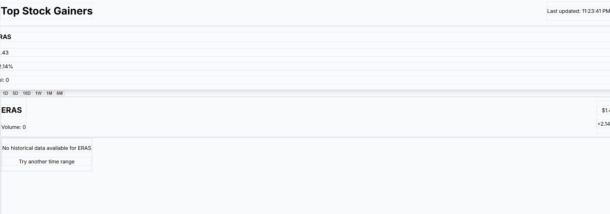

# Stock Gainers - Real-time Market Analysis App

A dynamic Next.js application for tracking top gaining stocks with interactive charts and real-time market data using Finnhub API.



## Project Overview

Stock Gainers is a web application (Dev In Progress) that allows users to:

- Track top-performing stocks in real-time
- View detailed stock price charts with customizable time ranges
- Analyze historical stock data
- Monitor key metrics like price changes and trading volume
- Receive real-time updates via WebSocket connections

## Features

- **Real-time Stock Data**: Live price updates using Finnhub WebSocket API
- **Interactive Charts**: Responsive and interactive stock price charts using Lightweight Charts
- **Multiple Time Ranges**: View stock performance across 1D, 5D, 10D, 1W, 1M, and 6M periods
- **Responsive Design**: Mobile-friendly interface that works on all devices
- **Data Caching**: Optimized API usage with smart caching strategies
- **Error Handling**: Robust error management for API failures
- **Loading States**: Smooth user experience with loading indicators
- **Keyboard Navigation**: Accessible interface with keyboard shortcuts

## Tech Stack

- **Frontend**: Next.js 14 with App Router, React 18, TypeScript
- **Styling**: Tailwind CSS for responsive design
- **Authentication**: NextAuth.js for secure user access
- **Charts**: Lightweight Charts for high-performance visualizations
- **API Integration**: Finnhub API for financial data
- **Real-time Updates**: WebSocket connections for live data

## Getting Started

### Prerequisites

- Node.js 18.0 or later
- Finnhub API key (register at [Finnhub.io](https://finnhub.io))

### Environment Setup

Create a `.env.local` file in the root directory with:

```
NEXT_PUBLIC_FINNHUB_API_KEY=your_finnhub_api_key
NEXTAUTH_URL=http://localhost:3000
NEXTAUTH_SECRET=your_nextauth_secret
```

### Installation

```bash
# Clone the repository
git clone https://github.com/YourUsername/stock-analysis-app.git

# Navigate to project directory
cd stock-analysis-app

# Install dependencies
npm install

# Start development server
npm run dev
```

Open [http://localhost:3000](http://localhost:3000) in your browser to see the application.

## Project Structure

```
src/
├── app/               # Next.js App Router pages
│   ├── page.tsx       # Landing page
│   ├── dashboard/     # Stock analysis dashboard
│   └── auth/          # Authentication pages
├── components/        # Reusable UI components
│   ├── charts/        # Chart components
│   └── ...
├── lib/               # Utility functions and services
│   ├── api/           # API integration services
│   └── config.ts      # Application configuration
└── types/             # TypeScript type definitions
```

## API Integration

This application uses the Finnhub API for:

1. **Stock Symbol Lookup**: Getting top gainers and stock data
2. **Historical Candle Data**: Retrieving price history for charting
3. **Real-time WebSocket**: Subscribing to live price updates

The app implements a throttling mechanism to respect Finnhub's rate limits of 60 requests per minute on the free tier.

## Future Improvements

- Portfolio tracking and watchlists
- Advanced technical indicators
- Customizable dashboards
- News integration for selected stocks
- Performance optimizations for mobile devices

## License

This project is licensed under the MIT License - see the LICENSE file for details.

## Acknowledgements

- [Finnhub](https://finnhub.io) for providing financial data API
- [Lightweight Charts](https://tradingview.github.io/lightweight-charts/) for chart visualization
- [Next.js](https://nextjs.org) for the React framework
- [Tailwind CSS](https://tailwindcss.com) for styling
